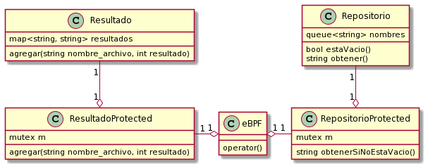
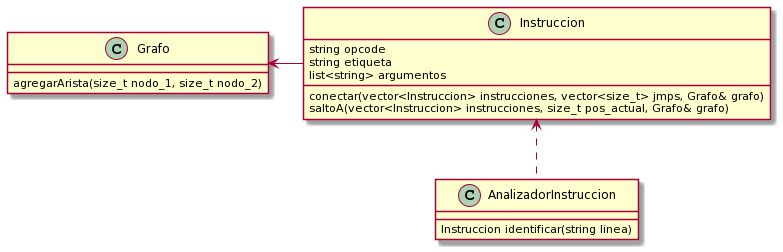

# TP2

Nombre completo: Sebastian Bento Inneo Veiga

Padron: 100998

Link: https://github.com/SBen-IV/tp2

# Descripción

El trabajo práctico presentado corresponde a un programa que puede leer archivos .bpf y analizarlos en búsqueda de ciclos o instrucciones sin usar.

## Lista de clases más importantes

### eBPF

#TODO

eBPF es la clase que maneja todo el comportamiento del programa y las demás clases. Es en el método `operator()` donde está el bucle que va tomando los archivos uno a uno y analizándolos para luego guardar los resultados de los mismos.

### Grafo

Grafo es la clase que contiene las conexiones entre las lineas como nodos y aristas. Implementado a base de un un vector de `Nodo` para poder diferenciar instrucciones iguales pero en distinta línea. Además se encarga de buscar búcles o nodos sin visitar con el método `aplicarDFS()`. Los métodos implementados fueron los que únicamente se necesitaban para este TP.

### Instruccion

Instruccion es una clase contenedora de la linea que se obtiene del archivo y además tiene por separado las partes que componen a la línea como lo son la etiqueta, opcode y los argumentos. `conectar()` agrega aristas desde el último nodo al nodo actual en caso de ser necesario, además si la instrucción actual es un `jmp` lo agrega al vector de `jmps`. Este vector será usado más adelante para buscar las etiquetas a los que los `jmps` saltan.